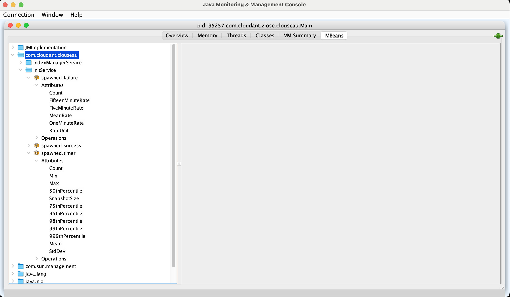

# ziose

The `ziose` project is an attempt to replace foundation of [`clouseau`](https://github.com/cloudant-labs/clouseau/) with
a [`ZIO`](https://github.com/zio/zio) as an asynchronous scheduler.

## Build status

[](https://wcp-cloudantnosqldb-prod-jenkins.swg-devops.com/job/cloudant/job/ziose/job/main/)

## Disclaimer

This project is highly experimental and therefore, NOT SUPPORTED. Moreover, we can and will change the API as necessary.
The integrity of commit history is not guaranteed either. We might decide to clean up the history in the future.

Thus, use it at your own risk.

## Dependency management

This project uses experimental approach to use a combination of [`asdf`](https://github.com/asdf-vm/asdf) tool
management and [`direnv`](https://github.com/direnv/direnv/). The `direnv` tool is brought
by [`asdf-direnv`](https://github.com/asdf-community/asdf-direnv) plugin.

All tools managed by `asdf` are configured in `.tool-versions` which looks somewhat like the following:

```
java semeru-openj9-_openj9-
sbt 1.8.2
scala 2.13.8
erlang 25.0.2
```

The setup also tracks the host dependencies which are required by the project. These dependencies are specified
in `.deps` file which looks like the following:

```
pkgutil:com.apple.pkg.CLTools_Executables::Open the App Store on the Mac, and search for Xcode.
brew:coreutils::brew install coreutils
asdf::brew install asdf
brew::/bin/bash -c "$(curl -fsSL https://raw.githubusercontent.com/Homebrew/install/HEAD/install.sh)"
```

The format of the lines in the file is `{tool}::{hint_how_to_install}`. The `tool` field can be in the one of the
following forms:

* `pkgutil:{package}`: for macOS packages, where `package` is the package id.
* `brew:{package}`: for [`brew`](https://brew.sh/) packages.
* `{binary}`: for a given binary tool present in the path (we use `type "${binary}"` to check it).

## Setting up the development environment

If you don't have `asdf` + `asdf-direnv` combination on your system already, there are extra steps that need to be done.
The steps are documented in full details [here](./scripts/bootstrap.md). Essentially the steps are:

1. Install [`asdf`](https://github.com/asdf-vm/asdf) with `brew install asdf`
2. Verify your OS has all tools we need using `scripts/cli verify`
3. Use step-by-step guide script to finish installation (you might need to call it multiple times) `scripts/cli bootstrap`
4. Restart your shell and `cd` into project directory
5. Enable configuration by calling `direnv allow`

## Running the build locally in Docker

1. Install [docker](https://www.docker.com/).
2. Login into [JFrog](https://na.artifactory.swg-devops.com/ui)
3. Generate an access token: click your account in the upper right corner, select`Edit Profile`, and then click `API Key`
4. `ARTIFACTORY_USR` is your email, and `ARTIFACTORY_PSW` is your `API Key`
5. Run the build: `ARTIFACTORY_PSW=*** ARTIFACTORY_USR=xxx@yy.ibm.com make build-in-docker`

## The `cli` tool

In order to simplify project maintenance we provide a `cli` command. This command becomes available in your terminal
when you `cd` into project directory.

Currently, `cli` provides following commands:

* `help`      - display help message
* `commands`  - list all commands
* `verify`    - verify developer setup
* `bootstrap` - a step-by-step guide to help set up environment
* `fmt`       - reformat scala code

You can find detailed documentation here [scripts/cli.md](./scripts/cli.md).

The plan is to implement things like

* `new exp {name}` - to provision experiment template in `experiments/` folder.
* `git {pr}` - to check out GitHub PR locally ???
* `git tree` - to display commit history as a tree
* `deps update` - to update all Java/Scala dependencies
* `deps fetch` - to fetch all Java/Scala to work offline
* `check all`
* `check <spec>`
* `run exp <Class>`

All the above are just examples and not a firm commitment.

## JMX + JConsole

**JMX:** A Java technology that provides tools for managing and monitoring applications, system objects, devices and
service-oriented networks.

**JConsole:** A graphical monitoring tool to monitor Java Virtual Machine and Java applications both on a local or
remote machine.

**How to monitor metrics using `jconsole`:**

1. Run clouseau first, `make clouseau1`
2. Open another terminal and type `make jconsole`
3. Select MBeans -> `com.cloudant.clouseau`



# Using `sbt`

```
actors / test
actors/testOnly com.cloudant.zio.actors.CodecSpec
actors/testOnly *CodecSpec
actors/testOnly *CodecSpec -- -DZIOSE_TEST_Generators=true
actors/testOnly *CodecSpec -- -DZIOSE_TEST_DEBUG=true
p
experiments/runMain com.cloudant.ziose.experiments.Hello
```

# Using Read-Eval-Print Loop

```scala
sbt> console
[info] Starting scala interpreter...
Welcome to Scala 2.13.8 (OpenJDK 64-Bit Server VM, Java 17).
Type in expressions for evaluation. Or try :help.

scala> import zio._
import zio._
scala> import zio.Console._
import zio.Console._
scala> import zio.stream.ZStream
import zio.stream.ZStream
scala> val stream = ZStream(1,2,3,4).merge(ZStream(9,8,7,6))
val stream: zio.stream.ZStream[Any,Nothing,Int] = zio.stream.ZStream@4368e720
scala> val tapped = stream.tap(x => printLine(s"${x}"))
val tapped: zio.stream.ZStream[Any,java.io.IOException,Int] = zio.stream.ZStream@14560718
scala> Unsafe.unsafe { implicit unsafe => Runtime.default.unsafe.run(tapped.runDrain) }
9
8
7
6
1
2
3
4
scala> :q
```