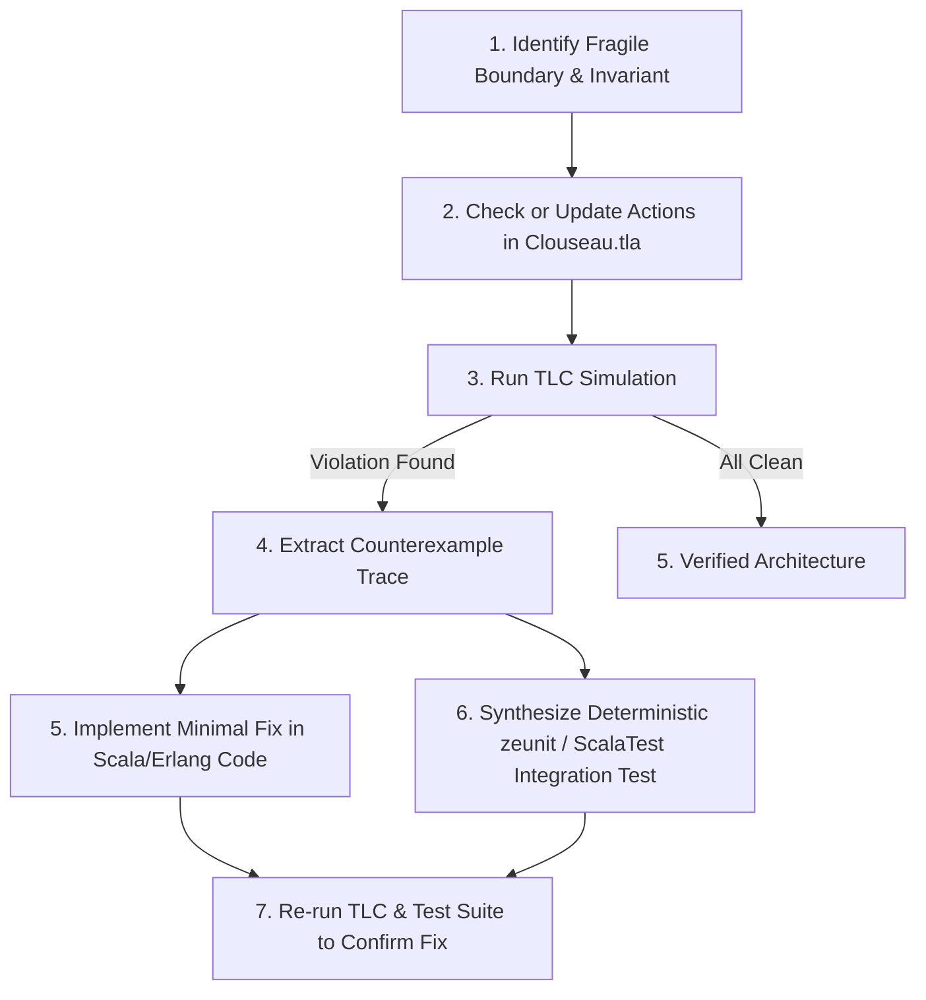

# Formal Verification of Clouseau with TLA+

This directory contains formal specifications and TLC model configurations for Clouseau's core concurrency, lifecycle, and storage protocols.

It serves as an executable architecture model and verification harness designed to be inspected, run, and evolved—especially when working alongside AI coding agents to diagnose distributed race conditions and verify bug fixes.

---

## 1. Directory Contents

* **[`Clouseau.tla`](Clouseau.tla)**: The canonical formal specification of Clouseau's current upstream codebase. It models actor lifecycles, LRU cache behavior, open waiter queues, and JInterface links. Running TLC against this model detects the known race conditions and invariant violations.
* **Configurations**:
  * [`Clouseau.cfg`](Clouseau.cfg): Base configuration (2 PIDs, 2 Paths, 2 Waiters, LRUCapacity = 1).
  * [`Clouseau_Stress.cfg`](Clouseau_Stress.cfg): High-concurrency profile with deep waiter queues and larger LRU capacity.
  * [`Clouseau_Starvation.cfg`](Clouseau_Starvation.cfg): Resource starvation profile stressing rapid LRU evictions and tight PID recycling.

---

## 2. System Model & State Mapping

The TLA+ model maps directly to Clouseau's Scala/ZIO implementation and its Erlang OTP client (Dreyfus):

| Component / Subsystem | Scala/Erlang Source | TLA+ Model Entities |
| :--- | :--- | :--- |
| **LRU Cache & Lifecycles** | `IndexManagerService.scala` | `lruMap`, `lruOrder`, `pidState` (`opening`, `running`, `terminating`, `dead`) |
| **Concurrent Open Queue** | `IndexManagerService.scala` (`waiters`) | `waiters`, `waiterStatus`, `waiterReceivedPid` |
| **JInterface Link Registry** | `node.link(peer, pid)` / Erlang monitors | `erlangLinks`, `clouseauLinks` |
| **Lucene Commits & Purges** | `IndexService.scala` | `luceneDocs`, `pendingSeq`, `committedSeq`, `purgeSeq`, `pendingPurgeSeq` |
| **Storage & Locking** | `NativeFSLock`, `IndexCleanupService.scala` | `fsLockHeld`, `fsDirState` (`exists`, `deleting`) |

---

## 3. Key Invariants

The specification checks domain-level safety properties across all reachable states:

1. **`NoStalePidOnReopen`**: An index client in Dreyfus must never receive a PID that is in the `"dead"` or terminating state.
2. **`JInterfaceLinkSymmetry`**: Active cross-node links must be mutually registered between Dreyfus and Clouseau (`p \in erlangLinks[path] <=> path \in clouseauLinks[p]`).
3. **`ActiveIndexValidDir`**: Active running indices in the LRU cache must always point to valid, non-corrupted directory paths (`"exists"`).

---

## 4. Running Model Checking and Simulation

TLC can explore the state space either via breadth-first exhaustive model checking or via randomized simulation. For deep, concurrent actor models, **randomized simulation** (`-simulate`) explores multi-step traces rapidly without state explosion.

### Prerequisites

TLC tools jar (`tla2tools.jar`) available on PATH or via a runner script:

```bash
# Set alias or invoke java directly:
alias tlc="java -XX:+UseParallelGC -cp /path/to/tla2tools.jar tlc2.TLC"
```

### Simulation Commands

```bash
# 1. Run simulation on base profile (detects stale PID race condition quickly)
tlc Clouseau.tla -config Clouseau.cfg -simulate num=10000

# 2. High-concurrency stress profile
tlc Clouseau.tla -config Clouseau_Stress.cfg -simulate num=10000

# 3. Resource starvation profile
tlc Clouseau.tla -config Clouseau_Starvation.cfg -simulate num=10000
```

---

## 5. Workflow for AI Agents & Developers

When diagnosing a new concurrency bug or designing a protocol change:



### Guidelines for Evolving the Model
- **Do not model internal data structures or low-level frame bytes**: Focus strictly on message passing, discrete lifecycle states, concurrency queues, and resource ownership.
- **Incremental edits**: When introducing a new message or API call, add the corresponding action to `Clouseau.tla`, update the `Next` relation, and verify against the test profiles.
- **Trace to Test**: Every counterexample produced by TLC (e.g. `*_TTrace_*.tla`) contains the exact sequence of interleavings needed to write a deterministic integration test under `zeunit/test/` or `clouseau/src/test/`.
